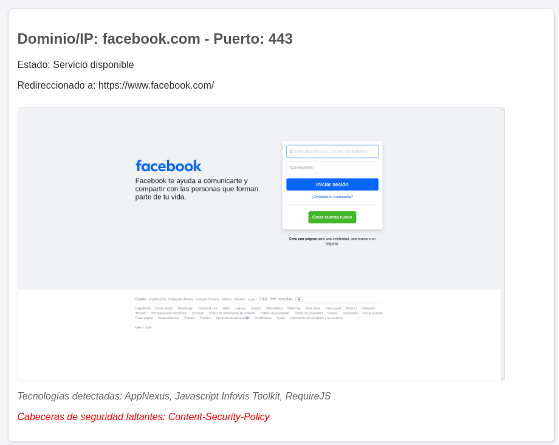

```
 _______  _______  ______    _______  _______  __    _  _______  __   __  ___   _______ 
|       ||       ||    _ |  |       ||       ||  |  | ||       ||  | |  ||   | |       |
|  _____||       ||   | ||  |    ___||    ___||   |_| ||  _____||  |_|  ||   | |_     _|
| |_____ |       ||   |_||_ |   |___ |   |___ |       || |_____ |       ||   |   |   |  
|_____  ||      _||    __  ||    ___||    ___||  _    ||_____  ||       ||   |   |   |  
 _____| ||     |_ |   |  | ||   |___ |   |___ | | |   | _____| ||   _   ||   |   |   |  
|_______||_______||___|  |_||_______||_______||_|  |__||_______||__| |__||___|   |___|  
```

# screenshit
Simple screenshot collector that allows you to scan domains or IPs and check HTTP/HTTPS services on ports 80 and 443 (by default), as well as additional specified ports. The result includes screenshots of the pages, detected technologies, and verification of HTTP security headers. The results are stored in an HTML file.

<p align="center" width="100%">
     
</p>

## Features

- Scanning HTTP/HTTPS ports (80 and 443) and additional specified ports.
- Screenshot of web pages.
- Detection of technologies used on the websites.
- Verification of HTTP security headers.
- Console status messages to show scanning progress.

## Requirements

- Python 3.x
- Google Chrome
- ChromeDriver

Dependencies:
- beautifulsoup4
- builtwith
- certifi
- charset-normalizer
- idna
- requests
- selenium
- soupsieve
- urllib3


## Installation

### Step 1: Clone the Repository

Clone this repository:

```bash
git clone https://github.com/unleashedmen/screenshit.git
cd screenshit
```
### Step 2: Create and Activate a Virtual Environment (Optional but Recommended)
```bash
virtualenv screenshit
source screenshit/bin/activate
```

### Step 3: Install the dependencies:
```bash
pip install -r requirements.txt
```
### Step 3: Install ChromeDriver
Download ChromeDriver and place it in your path (adjust the path in the script if necessary)

[ Download ChromeDriver ](https://developer.chrome.com/docs/chromedriver/downloads)

## Usage

### Step 1: Create a Text File with the List of Domains or IPs
Create a text file with the list of domains or IPs, one per line. Example (domain_list.txt):
```bash
example.com
192.168.1.1
```

### Step 2: Run the Script
```bash
python3 screenshit.py domain_list.txt -o output.html -p 8080 8443 8081

domain_list.txt: input file with the list of domains/IPs.
-o output.html: output HTML file (optional, default is results.html).
-p 8080 8443: additional ports to scan (optional).
```

## Contributing
Contributions are welcome. You can fork the repository and submit a pull request with your improvements or fixes.
